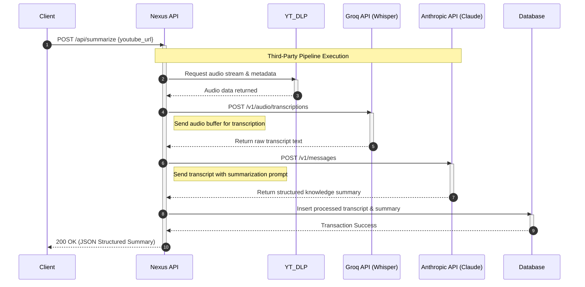
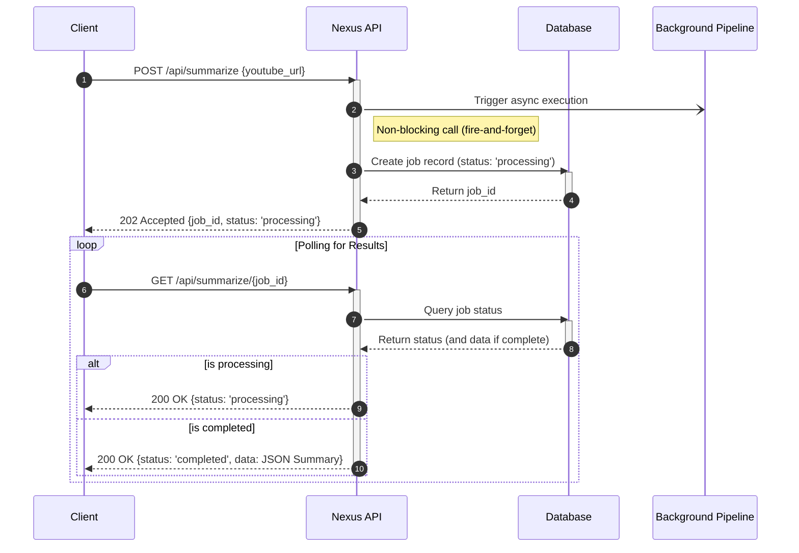
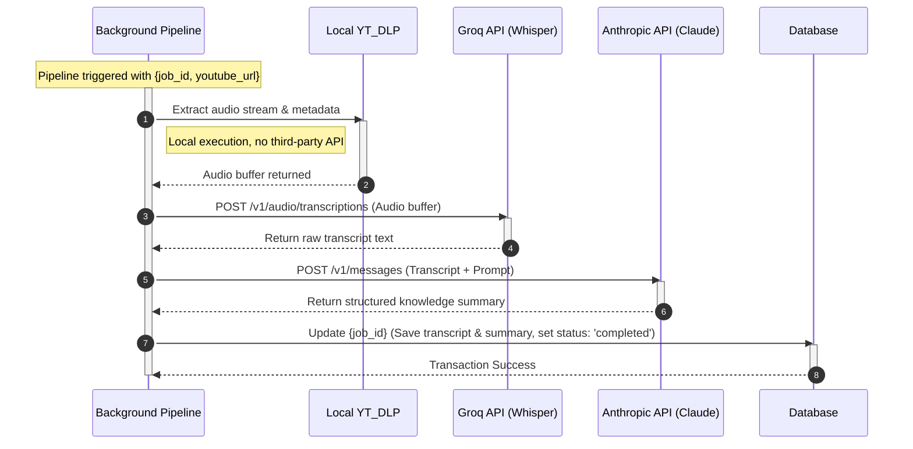

## Authentication system
A verification dependency decompile the JWT that came on the auth headers to extract the `sub` field. 
This `sub` field is used to related a specific generation to the users which started it. 

**From where is this token came from?**
The received token cames from a third party auth provider. For example, by using the "login with Google" button on the frontend, the frontend will get an `idToken` that will be sended on the auth headers. 

**For what is this authentication used for**
- On the generation endpoint: Stores this id on the `user_id` column of the `VideoRecord` table. 
- On getters: asserts that the requested generations corresponds to the user who's calling. 
- Helps to find all user's related generations to return a list of them. 
- Used to know the usage of each specific user, so them can be billed accordlingly. 

## Files structure
nexusyt/
│
├── database.py         # Engine and SessionLocal setup
├── models.py           # SQLAlchemy database tables (VideoRecord, ChatMessage)
├── schemas.py          # Pydantic models (ProcessRequest, ChatResponse)
├── main.py             # FastAPI App initialization and routing
├── .env                # Database URL and API keys
└── alembic/            # (Generated automatically by Alembic, the sqlalchemy migrations manager)

## Database setup
1. Initialize Alembic `alembic init alembic`. The previous command should create an `alembic` folder and a `alembic.ini` file. Configure this `alembic.ini`
2. Open the newly created `alembic.ini` file in your root folder. Find the line starting with `sqlalchemy.url` and comment it out so it doesn't hardcode sensitive credentials. This value will be taken from env variables on the next step. 
3. : Configure `alembic/env.py` (Crucial Step) -> see `alembic/env.py` file, comments starting with a number (i.e `# 1. Step One...`) explains the modifications performed on the file
4. Generate Your Initial Migration File -> `alembic revision --autogenerate -m "initial_schema`
5. Execute the migration `alembic upgrade head`

### How to handle changes from now on (Migrations)
When you need to add a feature (e.g., adding a provider column to VideoRecord or creating a new table):
1. Modify `models.py`: Make the code modifications directly to your declarative database models.
2. Autogenerate a new migration script: Run `alembic revision --autogenerate -m "the_migration_name"`.
3. Review the script: Always check the newly generated file inside `alembic/versions/` to make sure it picked up your changes correctly.
4. Deploy the changes: Run `alembic upgrade head`.

**NOTE:** In a production CI/CD pipeline, your deployment pipeline should automatically trigger `alembic upgrade head` before booting up the new FastAPI application instance.

**App Flow**

